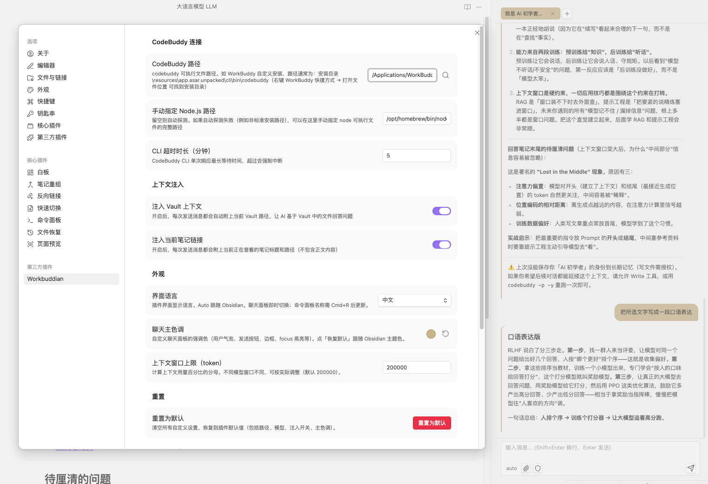

# Workbuddian

> **Turn the local WorkBuddy / CodeBuddy CLI into an AI agent that lives inside your Obsidian vault.** Chat with streaming replies, paste in a screenshot for visual analysis, reference your notes with `@`, and manage whole conversations — without ever leaving your notes.

[](https://github.com/jiang198012/workbuddian/stargazers)
[](https://github.com/jiang198012/workbuddian/releases)
[](https://github.com/jiang198012/workbuddian/actions/workflows/ci.yml)
[](https://github.com/jiang198012/workbuddian/releases/latest)
[](https://opensource.org/licenses/MIT)

> **⚠️ Windows and macOS are supported.** Linux is not supported yet.
> **Requires Obsidian 1.7.2+.**




> **⭐ If Workbuddian is useful to you, please [star the repo](https://github.com/jiang198012/workbuddian) — it helps more people discover it.**

## ✨ What's New

- **v1.2.3** — **Attachment name labels**: files attached to a user message now appear as labeled chips (paperclip + filename) inside the message bubble, so you can see at a glance what was sent.
- **v1.2.2** — **IME-friendly Enter**: composing text with an input method no longer sends the message by accident. Plus a **copy button** on every message (hover to reveal).
- **v1.2.1** — **Fix (Windows)**: referencing a large note or file with `@` no longer crashes with `spawn ENAMETOOLONG` — the prompt is now piped through stdin instead of the command line, so there's no length limit.
- **v1.2.0** — **Instruction mode (`#`)**: type `#your rule` in the chat to set a persistent instruction / persona that applies to every conversation (edit or clear it anytime from the toolbar). **`@` any file**: reference not just notes but any vault file — markdown is read inline, other files are attached for the CLI to read.

## Features

- **Streaming chat** in the sidebar or a full-width main-area tab, with collapsible **thinking** and **tool-call** cards, and Markdown rendering (code, tables, lists, quotes).
- **Image vision** — paste / drag a screenshot or image for the agent to analyze.
- **Instruction mode (`#`)** — a persistent custom instruction / persona injected into every message.
- **`@`-references any vault file** — notes are read inline; other files are attached for the CLI to read; selected note text is sent as read-only context automatically.
- **File attachments** — inject any file path for the CLI to read.
- **Conversation management** — multiple tabs, rename (double-click or right-click), export a conversation to a note or copy to clipboard, and full-text search across titles and messages; history persists across restarts.
- **In-chat toolbar** — switch model and permission mode inline; **slash commands** with autocomplete (built-in + your vault's `.codebuddy/commands`); **inline edit** with a diff preview; **real stop-generation** to interrupt a running response.
- **Bilingual UI (中文 / English)** with instant switching, a custom accent color, and settings import/export.
- **Cross-platform auto-discovery** of the CodeBuddy CLI and Node.js on Windows and macOS (WorkBuddy install, npm global, PATH, bundled Node, Homebrew, nvm/volta).

## Requirements

- **Obsidian 1.7.2 or later** (desktop).
- **Windows or macOS** (Linux is not supported yet).
- **WorkBuddy desktop app** (≥ 5.0.5) with CodeBuddy CLI installed, or a custom CodeBuddy path configured in settings.

## Installation

### From the community plugins directory (recommended)

1. In Obsidian: **Settings → Community plugins → Browse**.
2. Search **"Workbuddian"** → **Install** → **Enable**.

### Via BRAT (to track the latest beta)

1. Install the **BRAT** community plugin.
2. BRAT → *Add Beta Plugin* → enter `jiang198012/workbuddian`.
3. Enable **Workbuddian** in **Settings → Community plugins**.

### Manual

1. Download `main.js`, `manifest.json`, and `styles.css` from the [latest release](https://github.com/jiang198012/workbuddian/releases/latest).
2. Copy the three files into `.obsidian/plugins/workbuddian/` inside your vault.
3. Restart Obsidian, then enable **Workbuddian** in **Settings → Community plugins**.

### First-time setup

If Workbuddian cannot find CodeBuddy or Node.js automatically, follow the environment setup prompt once (see the Chinese section below or open `提示词-授予Vault读写权限.md`).

## Usage

1. Click the **robot ribbon icon** or run the command **"Workbuddian: Open chat panel"** from the command palette.
2. A chat panel opens in the right sidebar, joining the existing tab group (like Outline or Backlinks) so it takes the full sidebar height when active. To open it as a full-width tab in the main editor area instead, run the command **"Workbuddian: Open chat panel in main editor area"**.
3. Type your message and press **Enter** to send. Use **Shift + Enter** to insert a new line.
4. Switch between conversations using the tabs at the top, or click **+** to start a new one.
5. Open **Settings → Workbuddian** to configure the CodeBuddy CLI path manually if needed.

## Troubleshooting

| Symptom | Cause | Solution |
|---|---|---|
| `Cannot find codebuddy CLI` | Auto-detection failed | Fill the **CodeBuddy path** in plugin settings. Default location: `WorkBuddyInstallDir\resources\app.asar.unpacked\cli\bin\codebuddy` |
| `Cannot find Node.js` | Node.js is not configured | Run the first-time environment setup prompt (Chinese section below) |
| Stuck on "Thinking..." | Streaming ended without text chunks | Fixed |

## Related

Use **Obsidian** with **Claude Code** and know **Claudian**? Workbuddian is the counterpart for the **WorkBuddy / CodeBuddy** CLI — it turns that local coding agent into an in-vault chat panel. Same idea (a CLI agent living inside your notes), different backend.

---

# 中文说明

> 将 Obsidian 连接到 WorkBuddy/CodeBuddy CLI，实现侧边栏 AI 聊天。

## ✨ 更新

- **v1.2.2** —— **输入法 Enter 友好**：中文输入法拼字（有候选）时按 Enter 只上屏候选、不再误发送。每条消息 hover 时浮出**复制按钮**，一键复制原文。
- **v1.2.1** —— **修复（Windows）**：用 `@` 引用大笔记 / 大文件提问时不再报 `spawn ENAMETOOLONG`——prompt 改经 stdin 传入，不再受命令行长度限制。
- **v1.2.0** —— **指令模式 `#`**：聊天框输 `#你的规则` 设一条常驻指令 / 人设，对所有对话生效（工具栏可随时改 / 清）。**`@` 引用任意文件**：不只笔记——markdown 读正文嵌入，其它文件作附件交 CLI 读。

## 功能亮点

- **流式对话** —— 侧边栏或主编辑区全宽标签；可折叠的思考过程与工具调用卡片；Markdown 渲染。
- **图片视觉** —— 粘贴 / 拖拽截图或图片，交给 AI 分析。
- **指令模式 `#`** —— `#你的规则` 设常驻指令 / 人设，对所有对话生效，工具栏可随时改 / 清。
- **`@` 引用任意文件** —— markdown 读正文嵌入，其它文件作附件交 CLI 读；笔记里选中的文字自动作只读上下文。
- **文件附件** —— 注入任意文件路径交 CodeBuddy CLI 读取。
- **会话管理** —— 多标签、重命名（双击 / 右键）、导出为笔记 / 复制、全文搜索；重启后恢复历史。
- **输入框工具栏** —— 内联切换模型 / 授权模式；斜杠命令 + 自动补全；Inline Edit + Diff；真实停止生成。
- **中英双语界面** —— 即时切换、自定义主色、设置导入 / 导出。
- **跨平台自动发现** CodeBuddy CLI 与 Node.js（Windows/macOS：WorkBuddy 安装、npm 全局、PATH、自带 Node、Homebrew、nvm/volta）。

## 安装

### 从社区插件目录安装（推荐）

1. Obsidian 里：**设置 → 第三方插件 → 浏览**。
2. 搜索 **"Workbuddian"** → **安装** → **启用**。

### 通过 BRAT（追踪最新 beta）

1. 安装社区插件 **BRAT**。
2. BRAT → *Add Beta Plugin* → 填 `jiang198012/workbuddian`。
3. 在 **设置 → 第三方插件** 里启用 **Workbuddian**。

### 手动

1. 从 [latest release](https://github.com/jiang198012/workbuddian/releases/latest) 下载 `main.js`、`manifest.json`、`styles.css`。
2. 复制到 Vault 目录下的 `.obsidian/plugins/workbuddian/`。
3. 重启 Obsidian。
4. 进入 **设置 → 第三方插件 → 关闭安全模式 → 开启 Workbuddian**。

## 使用方法

1. 点击左侧的 **机器人图标**，或从命令面板运行 **"Workbuddian: 打开聊天面板"**。
2. 聊天面板会加入右侧栏现有的标签组（和大纲、反向链接一样），激活时占满整个侧边栏高度。如需在主编辑区打开为全宽标签页，请运行 **"Workbuddian: 在主编辑区打开大面板"** 命令。
3. 输入消息后按 **Enter** 发送；**Shift + Enter** 换行。
4. 顶部标签可切换对话，点击 **+** 新建对话。
5. 如需手动指定 CodeBuddy CLI 路径，进入 **设置 → Workbuddian**。

## 前置条件

1. 已安装 **WorkBuddy 桌面版**（≥ 5.0.5）
2. 已安装 **Obsidian**（≥ 1.7.2）

## 首次使用：环境初始化

如果插件无法自动找到 CodeBuddy 或 Node.js，将以下提示词**完整复制**到 WorkBuddy 对话中执行一次即可：

---

请帮我配置 Workbuddian 插件的运行环境，步骤如下：

1. 搜索 WorkBuddy 安装目录下的 `vendor/node.zip`（常见位置：`C:\Program Files\WorkBuddy`、`D:\Program Files\WorkBuddy`、`%LOCALAPPDATA%\Programs\WorkBuddy`）

2. 如果 `~/.workbuddy/binaries/node/versions/` 下还没有可用的 node.exe，将 node.zip 里的 `node-v*-win-x64/` 目录解压，把其中的文件复制到 `~/.workbuddy/binaries/node/versions/{版本号}/`（版本号从目录名提取，如 `22.22.2`）

3. 执行 `~/.workbuddy/binaries/node/versions/{版本号}/node.exe --version` 确认可用

4. 可选：同样处理 `vendor/PortableGit.zip`

完成后告诉我环境是否就绪。

---

执行完毕后，重启 Obsidian，Workbuddian 即可正常使用。

## 自动发现

插件启动时自动搜索以下位置：

| 搜索目标 | Windows 路径 |
|----------|-------------|
| WorkBuddy 安装 | `%LocalAppData%\Programs\WorkBuddy\...`、`%ProgramFiles%\WorkBuddy\...`、C/D/E 盘全覆盖 |
| npm 全局安装 | `%AppData%\npm\codebuddy.cmd`、`%ProgramFiles%\nodejs\...` |
| 系统 PATH | 遍历 `PATH` 中每个目录查找 `codebuddy.cmd` / `codebuddy.exe` |
| WorkBuddy 自带 Node | `~/.workbuddy/binaries/node/versions/*/` |
| 多盘符 Node | `C:\Program Files\nodejs`、D 盘、E 盘 |

## 故障排查

| 现象                          | 原因                       | 解决                         |
| --------------------------- | ------------------------ | -------------------------- |
| `找不到 codebuddy CLI`         | 自动检测未找到（如自定义安装路径） | 在插件设置中手动填写路径。默认路径：`WorkBuddy安装目录\resources\app.asar.unpacked\cli\bin\codebuddy`。右键 WorkBuddy 快捷方式 → 打开文件位置 可找到安装目录 |
| `找不到 Node.js 来运行 codebuddy` | Node.js 未正确配置            | 完成上方的「环境初始化」               |
| 一直显示「思考中」              | 流式结束未清理占位元素           | 已修复                |
| 重启后对话丢失                 | chatView 未正确持有导致无法加载历史 | 已修复                |
| `（无响应，请重试）`           | 本轮流式结束但没收到任何正文（纯工具调用轮 / CLI 超时 / 模型空回复） | 直接重试；仍旧则打开开发者控制台看 `[WB]` 日志（chunk 类型、exit code、stderr）判断 |

## 权限授权

插件需要 CodeBuddy 对 Vault 有读写权限才能正常工作。如果使用时提示权限不足，将 `提示词-授予Vault读写权限.md` 的完整内容发送给 WorkBuddy/CodeBuddy 执行一次即可。

完成后**完全退出** WorkBuddy/CodeBuddy（系统托盘右键退出），重新打开即可生效。

## 设置

| 设置项              | 说明                             | 默认值 |
| ------------------ | ------------------------------- | --- |
| CodeBuddy 路径       | CLI 可执行文件路径（留空自动检测）        | 自动  |
| CLI 超时时长（分钟）   | 单次响应最长等待时间，超时强制中断         | 5   |
| 手动指定 Node.js 路径 | 留空自动探测；探测失败时手动指定 node 完整路径 | 自动  |
| 注入 Vault 上下文     | 每次消息附上当前 Vault 路径             | 开   |
| 注入当前笔记链接        | 每次消息附上当前笔记标题+路径（不含正文）      | 关   |
| 界面语言             | Auto（跟随 Obsidian）/ 中文 / English | Auto |
| 聊天主色调           | 自定义强调色（留空＝默认土黄）             | 默认 |

> **模型**与**授权模式**已移到聊天输入框底部工具栏：点当前模型名可切换模型，点盾牌图标切换权限（默认 / 完全访问）。工具栏还有 **📎 附件**（挑任意文件注入）与 **`#` 常驻指令**。在笔记里选中文字会实时出现「选区」chip，随消息作只读上下文发送。

## 开发

```bash
npm run dev    # 开发构建
npm run build  # 生产构建
npm test       # 运行测试
```

## 相关项目

如果你在 **Obsidian** 里用 **Claude Code**，也许见过 **Claudian**——Workbuddian 就是面向 **WorkBuddy / CodeBuddy** CLI 的同类：把这个本地编程 agent 变成 vault 内的聊天面板。思路一致（让 CLI agent 住进笔记），后端不同。

---

## Credits / 致谢

Independent rework (derivative) of [BuddyBridge](https://github.com/ben4202121/buddybridge) (MIT); some code derives from it and stays MIT-licensed. UI references Claudian (MIT) for design patterns only. See `LICENSE` / `NOTICE`. Maintained independently; not affiliated with either.

基于 [BuddyBridge](https://github.com/ben4202121/buddybridge)（MIT）的独立重构（衍生作品），部分代码源自它并保留 MIT；UI 参考 Claudian（MIT，仅设计）。见 `LICENSE` / `NOTICE`。独立维护，不隶属于二者。

## License

MIT
