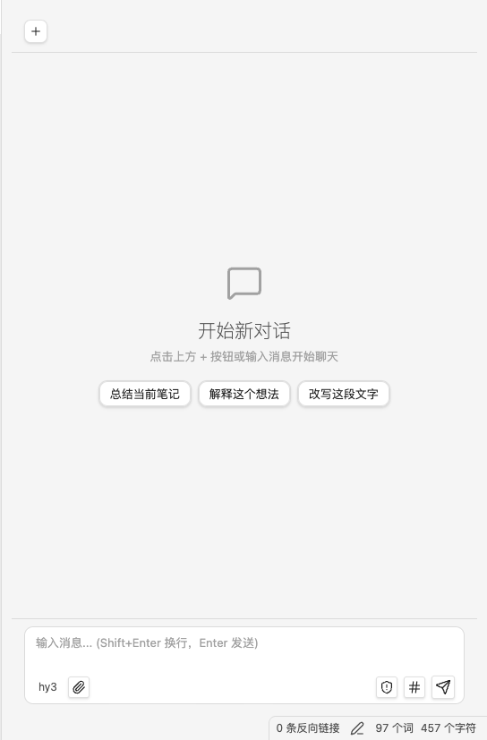

# Workbuddian

> **Turn the local WorkBuddy / CodeBuddy CLI into an AI agent that lives inside your Obsidian vault.** Chat with streaming replies, paste in a screenshot for visual analysis, reference your notes with `@`, and manage whole conversations — without ever leaving your notes.

[](https://github.com/jiang198012/workbuddian/stargazers)
[](https://github.com/jiang198012/workbuddian/releases)
[](https://github.com/jiang198012/workbuddian/actions/workflows/ci.yml)
[](https://github.com/jiang198012/workbuddian/releases/latest)
[](https://opensource.org/licenses/MIT)

> **⚠️ Windows and macOS are supported** (Linux is not supported yet). **Requires Obsidian 1.7.2+.**

<p align="center">
  
</p>

<p align="center">
  
  
</p>

> **⭐ If Workbuddian is useful to you, please [star the repo](https://github.com/jiang198012/workbuddian) — it helps more people discover it.**

## ✨ What's New

- **v2.1.0** — **A UX pass driven by the first usability review, plus an e2e testing base.** 617 unit tests all green; e2e exercises the real Obsidian end to end:
  - **Thinking no longer leaks into replies** — the message body is now anchored to the end of the bubble, so streamed thought text can never be rendered as the answer.
  - **Grouped input toolbar** — input controls (model / attachment) on the left, session controls (permission / instruction / usage / send) on the right, so the model button no longer gets squeezed in narrow panels.
  - **Message actions easier to find** — the copy button is softly visible by default (not only on hover), and code blocks get their own copy button.
  - **Smarter tab bar** — the active tab auto-scrolls into view, hover shows the full title, and a slimmer scrollbar keeps the current chat on screen with many tabs.
  - **Empty-state quick starts** — suggestion chips ("Summarize the current note / Explain this idea / Rewrite this text") that fill the input on click.
  - **Bash output expanded by default** — command results are what you care about; thinking / tool / diff blocks stay collapsed.
  - **Error-card timestamps** — each error card shows when it happened, so you can tell a fresh failure from a leftover one.
  - **i18n `t()` fallback chain** (current language → en → zh → key) lays the groundwork for more languages.
- **v2.0.1** — **A fully independent codebase.** Every remaining file derived from the original upstream was rewritten in fresh expression: all 48 source files now measure **under 30% line-level similarity** (45 of them under 10%, styles.css just 7.5%) — with public APIs, the on-disk data format, and all 617 tests unchanged. No behavior change, by design.
- **v2.0.0** — **A new engine: persistent ACP sessions, plus a wire-level reliability overhaul.** The provider no longer spawns a process per message — one long-lived `codebuddy --acp` process hosts every conversation:
  - **Faster, resumable conversations** — true multi-turn context with a visibly quicker second turn; if the CLI process dies, resend and the session restores itself (with an honest error card in between).
  - **Approvals in the bubble** — Write (path + line count), Edit (path + diff preview), Bash (full command), and MCP tools all ask permission on a card; plan mode shows a **"plan ready" card that continues in the same turn** — no more re-sending.
  - **Watch the agent work** — each tool call updates its own row live, then finishes with a collapsed **structured diff**; vault edits get a guarded **one-click undo**.
  - **Fork any chat** — branch a conversation with its full history from the tab's context menu.
  - **Two panels, really isolated** — the sidebar and main-area panels bind to separate sessions, with per-panel stop.
  - **`@` everything** — subagents, MCP servers, notes (`@[[note]]` reads the note), and any file, in one dropdown. **Visual MCP server management** with two-way JSON sync, and **custom subagents** defined in JSON.
  - **Auto chat titles** that yield instantly to your next message; **thinking effort levels** with `/effort` syncing back to settings; **native image pasting** from screenshots or Finder (TIFF auto-converted); an **external-attachment consent dialog** — files outside your vault are never read without your OK; **word-level diff highlighting**; Bash output blocks; subagent output blocks.
  - **Reliability proven on the wire** — three rounds of GUI testing plus a purpose-built ACP probe (`scripts/acp-probe.mjs`) pinned down how the CLI really routes sessions and applies config. Prompts are now serialized, sessions are re-activated before each turn, mis-tagged events are re-routed to the live session, config is applied to the correct session first, and a wedged CLI state machine self-heals through a supervised process restart.
- **v1.2.0 – v1.5.0** — **Everything that made the agent's work visible and reversible:** line-level diffs with one-click undo, plan mode, the `/resume` conversation picker, keyboard-first completion, an accessibility pass, the context-usage ring, message thumbnails, the dynamic model list, IME-friendly Enter, and instruction mode (`#`). Details in the [CHANGELOG](CHANGELOG.md).

## Features

- **Streaming chat** in the sidebar or a full-width main-area tab, with collapsible **thinking** and **tool-call** cards, and Markdown rendering (code, tables, lists, quotes).
- **Image vision** — paste / drag a screenshot or image for the agent to analyze.
- **Instruction mode (`#`)** — a persistent custom instruction / persona injected into every message.
- **`@`-references any vault file** — notes are read inline; other files are attached for the CLI to read; selected note text is sent as read-only context automatically.
- **File attachments** — inject any file path for the CLI to read.
- **Conversation management** — multiple tabs, rename (double-click or right-click), export a conversation to a note or copy to clipboard, and full-text search across titles and messages; history persists across restarts.
- **In-chat toolbar** — switch model and permission mode inline; **slash commands** with autocomplete (built-in + your vault's `.codebuddy/commands`); **inline edit** with a diff preview; **real stop-generation** to interrupt a running response.
- **Bilingual UI (中文 / English)** with instant switching, a custom accent color, and settings import/export.
- **Cross-platform auto-discovery** of the CodeBuddy CLI and Node.js on Windows and macOS (WorkBuddy install, npm global, PATH, bundled Node, Homebrew, nvm/volta).

## Requirements

- **Obsidian 1.7.2 or later** (desktop).
- **Windows or macOS** (Linux is not supported yet).
- **WorkBuddy desktop app** (≥ 5.0.5) with CodeBuddy CLI installed, or a custom CodeBuddy path configured in settings.

## Installation

### From the community plugins directory (recommended)

1. In Obsidian: **Settings → Community plugins → Browse**.
2. Search **"Workbuddian"** → **Install** → **Enable**.

### Via BRAT (to track the latest beta)

1. Install the **BRAT** community plugin.
2. BRAT → *Add Beta Plugin* → enter `jiang198012/workbuddian`.
3. Enable **Workbuddian** in **Settings → Community plugins**.

### Manual

1. Download `main.js`, `manifest.json`, and `styles.css` from the [latest release](https://github.com/jiang198012/workbuddian/releases/latest).
2. Copy the three files into `.obsidian/plugins/workbuddian/` inside your vault.
3. Restart Obsidian, then enable **Workbuddian** in **Settings → Community plugins**.

### First-time setup

If Workbuddian cannot find CodeBuddy or Node.js automatically, copy the prompt below **in full** into a WorkBuddy chat and run it once:

---

Please configure the runtime environment for the Workbuddian plugin, as follows:

1. Locate `vendor/node.zip` under your WorkBuddy install directory (common paths: `C:\Program Files\WorkBuddy`, `D:\Program Files\WorkBuddy`, `%LOCALAPPDATA%\Programs\WorkBuddy`).

2. If no usable `node.exe` exists under `~/.workbuddy/binaries/node/versions/`, extract the `node-v*-win-x64/` folder from `node.zip` and copy its files to `~/.workbuddy/binaries/node/versions/{version}/` (extract the version from the folder name, e.g. `22.22.2`).

3. Run `~/.workbuddy/binaries/node/versions/{version}/node.exe --version` to confirm it works.

4. Optional: do the same for `vendor/PortableGit.zip`.

Tell me once the environment is ready.

---

Then restart Obsidian and Workbuddian will work.

> **Vault permissions:** Workbuddian needs the CodeBuddy CLI to read/write your vault. If you see a permission error, send the full contents of `提示词-授予Vault读写权限.md` to WorkBuddy/CodeBuddy once, then **fully quit** WorkBuddy (tray icon → Quit) and reopen it.

## Usage

1. Click the **robot ribbon icon** or run the command **"Workbuddian: Open chat panel"** from the command palette.
2. A chat panel opens in the right sidebar, joining the existing tab group (like Outline or Backlinks) so it takes the full sidebar height when active. To open it as a full-width tab in the main editor area instead, run the command **"Workbuddian: Open chat panel in main editor area"**.
3. Type your message and press **Enter** to send. Use **Shift + Enter** to insert a new line.
4. Switch between conversations using the tabs at the top, or click **+** to start a new one.
5. Open **Settings → Workbuddian** to configure the CodeBuddy CLI path manually if needed.

## Troubleshooting

| Symptom | Cause | Solution |
|---|---|---|
| `Cannot find codebuddy CLI` | Auto-detection failed | Fill the **CodeBuddy path** in plugin settings. Default location: `WorkBuddyInstallDir\resources\app.asar.unpacked\cli\bin\codebuddy` |
| `Cannot find Node.js` | Node.js is not configured | Run the first-time environment setup prompt (see "First-time setup" above) |
| Stuck on "Thinking..." | Streaming ended without text chunks | Fixed |
| Conversation history missing after restart | The chat view failed to hold a reference and couldn't load history | Fixed |
| `（No response, please retry）` | This turn ended without any text (a pure tool call / CLI timeout / empty model reply) | Retry directly; if it persists, open the developer console and check the `[WB]` logs (chunk type, exit code, stderr) |

## Related

Use **Obsidian** with **Claude Code** and know **Claudian**? Workbuddian is the counterpart for the **WorkBuddy / CodeBuddy** CLI — it turns that local coding agent into an in-vault chat panel. Same idea (a CLI agent living inside your notes), different backend.

---

# 中文说明

> 将 Obsidian 连接到 WorkBuddy/CodeBuddy CLI，实现侧边栏 AI 聊天。

## ✨ 更新

- **v2.1.0** —— **首轮 UX 体检驱动的全面改造 + e2e 测试基建。** 617 项单测全绿；e2e 连真实 Obsidian 全流程验证。
  - **思考内容不再泄漏进回复正文** —— 正文容器锚定到气泡末尾（思考/工具块之后），流式过程中的思考文本绝不会再被渲染成答案。
  - **输入工具栏分组** —— 左侧输入相关（模型/附件）、右侧会话控制（授权/指令/用量/发送），窄面板下模型按钮不再被压扁。
  - **消息操作更好找** —— 复制按钮默认半透明可见（不再仅 hover 浮出），代码块自带独立复制按钮。
  - **标签栏更聪明** —— 选中标签自动滚入可视区、悬停显示完整标题、细滚动条，标签再多也不把当前对话挤出屏幕。
  - **空态快速开始** —— 「总结当前笔记 / 解释这个想法 / 改写这段文字」建议 chips，点击即填入输入框。
  - **Bash 输出默认展开** —— 命令结果是用户关心的；思考/工具/diff 保持折叠。
  - **错误卡时间戳** —— 每个错误卡显示发生时间，一眼区分「刚发生」与「历史遗留」。
  - **i18n `t()` 回落链**（当前语言 → en → zh → key），为更多语言铺路。
- **v2.0.1** —— **完全独立的代码基座。** 与上游有渊源的所有文件都以全新表达重写完毕：48 个源文件逐行比对**相似度全部低于 30%**（其中 45 个低于 10%，styles.css 仅 7.5%），公开 API、磁盘数据格式、617 项测试全部不变。`LICENSE` / `NOTICE` / `README` 中的上游署名行相应移除。按设计，本版无行为变更。
- **v2.0.0** —— **新引擎：ACP 持久会话 + wire 级可靠性攻坚。** provider 不再每条消息起一个进程——一个常驻的 `codebuddy --acp` 进程承载所有对话：
  - **更快、可恢复的多轮对话** —— 上下文真保持，第二轮起明显加速；CLI 进程意外退出后重发即自动恢复会话（中间有诚实的报错卡）。
  - **气泡内批准卡** —— Write（路径+行数）、Edit（路径+diff 预览）、Bash（命令全文）、MCP 工具按卡批准；计划模式出「计划已就绪」卡，**同一轮继续执行**，不再重发。
  - **看着 AI 干活** —— 每个工具调用就地更新一行，完成后出默认折叠的**结构化 diff**;vault 内的编辑带多重保护的**一键撤销**。
  - **分叉任意会话** —— 标签右键即可开出含全部历史的支线。
  - **双面板真隔离** —— 侧栏与主编辑区各自绑定会话，定向停止互不影响。
  - **`@` 一切** —— 子代理、MCP 服务器、笔记（`@[[名]]` 读正文）、任意文件，一个下拉全聚合；**MCP 可视化管理**（JSON 双向同步）;**自定义子代理**(JSON 定义）。
  - **自动会话标题**（你一发消息它立即让位，绝不拖慢吐字）;**思考力度**七档设置，`/effort` 改动同步回设置页；**原生图片粘贴**（截图/Finder，TIFF 自动转 PNG）;**vault 外附件授权窗**——不经你点头，vault 外的文件内容一律到不了模型；**词级 diff 高亮**;Bash 输出块；子代理输出块。
  - **wire 级实锤的可靠性** —— 三轮真实 GUI 手测 + 专用 ACP 探针（`scripts/acp-probe.mjs`）摸清了 CLI 路由会话与下发配置的真实行为：prompt 串行化、每轮前重激活会话、误标事件纠偏归队、配置先激活目标会话再下发、CLI 状态机卡死自动重启自愈。
- **v1.2.0 – v1.5.0** —— **让 AI 的工作看得见、审得了、退得回的一切基础：** 行级 diff 与一键撤销、计划模式、`/resume` 会话选择器、补全键盘支持、无障碍改进、上下文用量圆环、消息内图片缩略图、动态模型列表、输入法 Enter 友好、指令模式 `#`。详见 [CHANGELOG](CHANGELOG.md)。

## 功能亮点

- **流式对话** —— 侧边栏或主编辑区全宽标签；可折叠的思考过程与工具调用卡片；Markdown 渲染。
- **图片视觉** —— 粘贴 / 拖拽截图或图片，交给 AI 分析。
- **指令模式 `#`** —— `#你的规则` 设常驻指令 / 人设，对所有对话生效，工具栏可随时改 / 清。
- **`@` 引用任意文件** —— markdown 读正文嵌入，其它文件作附件交 CLI 读；笔记里选中的文字自动作只读上下文。
- **文件附件** —— 注入任意文件路径交 CodeBuddy CLI 读取。
- **会话管理** —— 多标签、重命名（双击 / 右键）、导出为笔记 / 复制、全文搜索；重启后恢复历史。
- **输入框工具栏** —— 内联切换模型 / 授权模式；斜杠命令 + 自动补全；Inline Edit + Diff；真实停止生成。
- **中英双语界面** —— 即时切换、自定义主色、设置导入 / 导出。
- **跨平台自动发现** CodeBuddy CLI 与 Node.js（Windows/macOS：WorkBuddy 安装、npm 全局、PATH、自带 Node、Homebrew、nvm/volta）。

## 安装

### 从社区插件目录安装（推荐）

1. Obsidian 里：**设置 → 第三方插件 → 浏览**。
2. 搜索 **"Workbuddian"** → **安装** → **启用**。

### 通过 BRAT（追踪最新 beta）

1. 安装社区插件 **BRAT**。
2. BRAT → *Add Beta Plugin* → 填 `jiang198012/workbuddian`。
3. 在 **设置 → 第三方插件** 里启用 **Workbuddian**。

### 手动

1. 从 [latest release](https://github.com/jiang198012/workbuddian/releases/latest) 下载 `main.js`、`manifest.json`、`styles.css`。
2. 复制到 Vault 目录下的 `.obsidian/plugins/workbuddian/`。
3. 重启 Obsidian。
4. 进入 **设置 → 第三方插件 → 关闭安全模式 → 开启 Workbuddian**。

## 使用方法

1. 点击左侧的 **机器人图标**，或从命令面板运行 **"Workbuddian: 打开聊天面板"**。
2. 聊天面板会加入右侧栏现有的标签组（和大纲、反向链接一样），激活时占满整个侧边栏高度。如需在主编辑区打开为全宽标签页，请运行 **"Workbuddian: 在主编辑区打开大面板"** 命令。
3. 输入消息后按 **Enter** 发送；**Shift + Enter** 换行。
4. 顶部标签可切换对话，点击 **+** 新建对话。
5. 如需手动指定 CodeBuddy CLI 路径，进入 **设置 → Workbuddian**。

## 前置条件

1. 已安装 **WorkBuddy 桌面版**（≥ 5.0.5）
2. 已安装 **Obsidian**（≥ 1.7.2）

## 首次使用：环境初始化

如果插件无法自动找到 CodeBuddy 或 Node.js，将以下提示词**完整复制**到 WorkBuddy 对话中执行一次即可：

---

请帮我配置 Workbuddian 插件的运行环境，步骤如下：

1. 搜索 WorkBuddy 安装目录下的 `vendor/node.zip`（常见位置：`C:\Program Files\WorkBuddy`、`D:\Program Files\WorkBuddy`、`%LOCALAPPDATA%\Programs\WorkBuddy`）

2. 如果 `~/.workbuddy/binaries/node/versions/` 下还没有可用的 node.exe，将 node.zip 里的 `node-v*-win-x64/` 目录解压，把其中的文件复制到 `~/.workbuddy/binaries/node/versions/{版本号}/`（版本号从目录名提取，如 `22.22.2`）

3. 执行 `~/.workbuddy/binaries/node/versions/{版本号}/node.exe --version` 确认可用

4. 可选：同样处理 `vendor/PortableGit.zip`

完成后告诉我环境是否就绪。

---

执行完毕后，重启 Obsidian，Workbuddian 即可正常使用。

## 自动发现

插件启动时自动搜索以下位置：

| 搜索目标 | Windows | macOS |
|----------|---------|-------|
| WorkBuddy 安装 | `%LocalAppData%\Programs\WorkBuddy\...`、`%ProgramFiles%\WorkBuddy\...`、C/D/E 盘全覆盖 | `/Applications/WorkBuddy.app/...`、`~/Applications/WorkBuddy.app/...` |
| npm 全局安装 | `%AppData%\npm\codebuddy.cmd`、`%ProgramFiles%\nodejs\...` | npm 全局 `bin/`（`codebuddy`、`node`） |
| 系统 PATH | 遍历 `PATH` 查找 `codebuddy.cmd` / `codebuddy.exe` | 遍历 `PATH` 查找 `codebuddy` / `node` |
| 版本管理器 | nvm / volta | nvm（`~/.nvm`）、volta（`~/.volta/bin`） |
| Homebrew | — | `/opt/homebrew/bin`（Apple Silicon）、`/usr/local/bin`（Intel） |
| WorkBuddy 自带 Node | `~/.workbuddy/binaries/node/versions/*/` | `~/.workbuddy/binaries/node/versions/*/` |
| 多盘符 / 多路径 Node | `C:\Program Files\nodejs`、D 盘、E 盘 | 常见自定义安装目录 |

## 故障排查

| 现象                          | 原因                       | 解决                         |
| --------------------------- | ------------------------ | -------------------------- |
| `找不到 codebuddy CLI`         | 自动检测未找到（如自定义安装路径） | 在插件设置中手动填写路径。默认路径：`WorkBuddy安装目录\resources\app.asar.unpacked\cli\bin\codebuddy`。右键 WorkBuddy 快捷方式 → 打开文件位置 可找到安装目录 |
| `找不到 Node.js 来运行 codebuddy` | Node.js 未正确配置            | 完成上方的「环境初始化」               |
| 一直显示「思考中」              | 流式结束未清理占位元素           | 已修复                |
| 重启后对话丢失                 | chatView 未正确持有导致无法加载历史 | 已修复                |
| `（无响应，请重试）`           | 本轮流式结束但没收到任何正文（纯工具调用轮 / CLI 超时 / 模型空回复） | 直接重试；仍旧则打开开发者控制台看 `[WB]` 日志（chunk 类型、exit code、stderr）判断 |

## 权限授权

插件需要 CodeBuddy 对 Vault 有读写权限才能正常工作。如果使用时提示权限不足，将 `提示词-授予Vault读写权限.md` 的完整内容发送给 WorkBuddy/CodeBuddy 执行一次即可。

完成后**完全退出** WorkBuddy/CodeBuddy（系统托盘右键退出），重新打开即可生效。

## 设置

| 分组 | 设置项 | 说明 | 默认值 |
| --- | --- | --- | --- |
| CodeBuddy 连接 | CodeBuddy 路径 | CLI 可执行文件路径（留空自动检测） | 自动 |
| | 手动指定 Node.js 路径 | 留空自动探测；探测失败时手动指定 node 完整路径 | 自动 |
| | CLI 超时时长（分钟） | 单次响应最长等待时间，超时强制中断 | 5 |
| | 思考力度 | 对应 CLI thought_level（按会话生效），`/effort` 改动同步回这里 | enabled |
| | MCP 服务器 | stdio 传输的 MCP 服务器 JSON 数组；可视化列表 + JSON 双向同步 | 空 |
| | 子代理 | 自定义子代理 JSON（对应 CLI `--agents`，支持 tools/model 键） | 空 |
| 上下文注入 | 注入 Vault 上下文 | 每次消息附上当前 Vault 路径 | 开 |
| | 注入当前笔记链接 | 每次消息附上当前笔记标题+路径（不含正文） | 关 |
| | 自动生成会话标题 | 首轮回复后由 AI 命名新会话；手动改名不被覆盖 | 开 |
| | 粘贴图保留数量 | 插件目录内最多保留的粘贴图数量，0 = 不限制 | 20 |
| 外观 | 界面语言 | Auto（跟随 Obsidian）/ 中文 / English | Auto |
| | 聊天主色调 | 自定义强调色；「恢复默认」跟随 Obsidian 主题色 | 跟随主题 |
| | 上下文窗口上限（token） | 上下文用量百分比的分母，按模型窗口调整 | 200000 |
| 管理 | 导出设置 | 把当前设置保存为 JSON 文件，便于备份/迁移 | — |
| | 导入设置 | 从导出的 JSON 文件恢复设置 | — |
| | 重置为默认 | 清空所有自定义设置，恢复插件默认值 | — |
| | 查看日志 | 打开 `[WB]` 日志面板，排查问题用 | — |

> **模型**与**授权模式**已移到聊天输入框底部工具栏：点当前模型名可切换模型，点盾牌图标切换权限（默认 / 完全访问）。工具栏还有 **📎 附件**（挑任意文件注入）与 **`#` 常驻指令**。在笔记里选中文字会实时出现「选区」chip，随消息作只读上下文发送。

## 开发

```bash
npm run dev    # 开发构建
npm run build  # 生产构建
npm test       # 运行测试
```

## 相关项目

如果你在 **Obsidian** 里用 **Claude Code**，也许见过 **Claudian**——Workbuddian 就是面向 **WorkBuddy / CodeBuddy** CLI 的同类：把这个本地编程 agent 变成 vault 内的聊天面板。思路一致（让 CLI agent 住进笔记），后端不同。

---

## License

MIT
