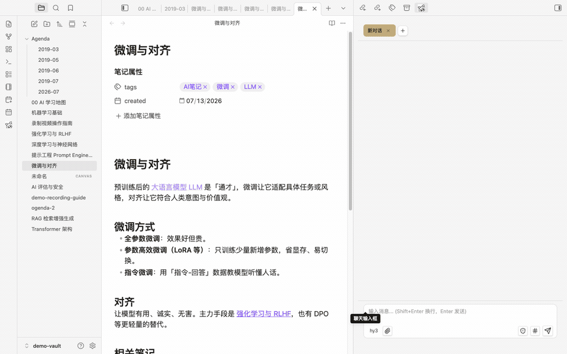
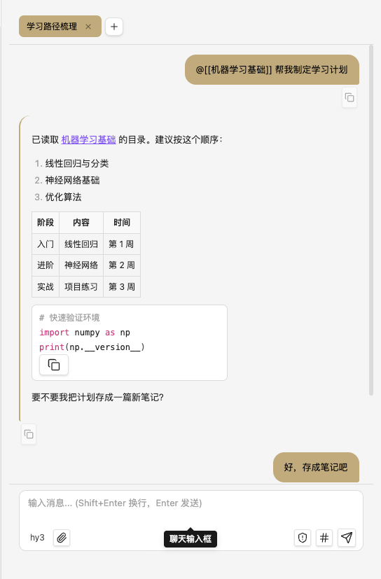
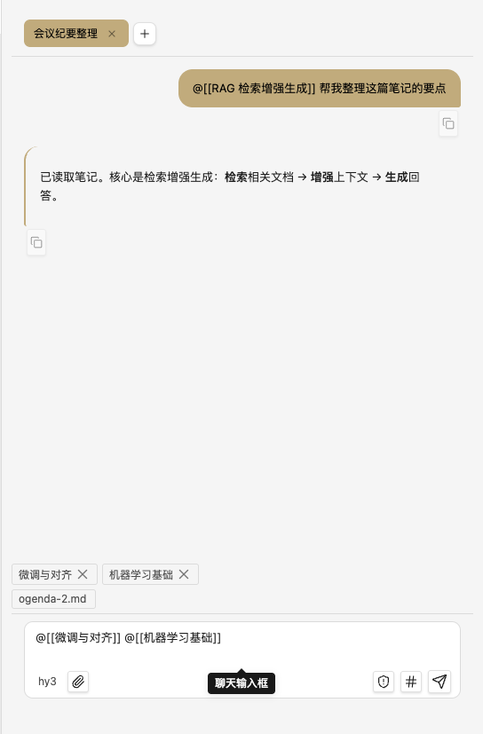

<p align="center">
  <strong>Workbuddian</strong>
</p>

<p align="center">
  <a href="https://github.com/jiang198012/workbuddian/releases/latest"></a>
  <a href="https://github.com/jiang198012/workbuddian/releases"></a>
  <a href="https://github.com/jiang198012/workbuddian/actions/workflows/ci.yml"></a>
  <a href="https://obsidian.md/plugins?id=workbuddian"></a>
  <a href="https://github.com/jiang198012/workbuddian/stargazers"></a>
  <a href="https://opensource.org/licenses/MIT"></a>
</p>

<p align="center">
  <strong>简体中文</strong> | <a href="./README.en.md">English</a>
</p>

<!--
project: Workbuddian
domain: Obsidian 插件 / AI 聊天 / 本地 LLM agent
audience: Obsidian 中文用户(桌面端, Windows/macOS)
runtime: Obsidian 1.7.2+, CodeBuddy CLI, Node.js
status: stable (v2.1.0)
license: MIT
-->

**Workbuddian** 是一个 **Obsidian 社区插件**，把本地 **CodeBuddy CLI** 变成你笔记里的 **AI 聊天助手**——不用切窗口，直接在 Vault 里聊天、`@` 引用笔记、流式回复、改稿。

> ⚠️ **仅桌面端**（Windows / macOS），需 Obsidian 1.7.2+。Linux 暂不支持。

<p align="center">
  
</p>

<p align="center">
  
  
</p>

> **⭐ 如果你觉得 Workbuddian 有用,欢迎 [Star 这个仓库](https://github.com/jiang198012/workbuddian),帮助更多人发现它。**

## 功能亮点

| 能力 | 能带来什么 |
| --- | --- |
| **流式对话** | 侧边栏或主编辑区全宽标签;可折叠的思考过程与工具调用卡片;Markdown 渲染(代码/表格/列表/引用) |
| **图片视觉** | 粘贴 / 拖拽截图或图片,直接交给 AI 分析 |
| **`@` 四源聚合引用** | 一条消息同时带上子代理(`@Agent`)、MCP 服务器(`@mcp`)、笔记(`@[[笔记]]`)、任意文件,不用手动拼上下文 |
| **气泡内批准卡** | Write / Edit / Bash / MCP 工具按卡批准;计划模式出「计划已就绪」卡,**同一轮继续执行** |
| **行级 diff + 一键撤销** | 每个 Edit / Write 显示改了几行;vault 内的编辑可一键撤销,三道安全闸门保护你的文件 |
| **会话分叉与双面板** | 标签右键分叉任意会话;侧栏 + 主面板各自绑定独立会话,定向停止互不干扰 |
| **MCP 可视化管理** | 列表增删改 / 启停 / 剪贴板导入;JSON 直编双向即时同步;自定义子代理(JSON 定义) |
| **多语言界面** | 中文 / English 即时切换,自定义主色 |
| **指令模式 `#`** | 设一条常驻指令 / 人设,对所有对话生效 |

## 安全与权限

Workbuddian 是一个**能执行本地命令的 AI agent 插件**,我们把它能做什么讲清楚:

**会访问什么?**
- 运行你本机的 CodeBuddy / WorkBuddy CLI
- 读写你的 Vault 文件(在你授权时)
- 执行你配置的 MCP 服务器(经批准卡授权)

**什么时候触发?**
- 只在**你发消息**时。插件不会主动后台运行或偷跑。

**怎么授权?**
- 每个 Write / Edit / Bash / MCP 操作都在**气泡内批准卡**上让你确认
- vault 外的文件,不经你同意内容根本到不了模型

**你怎么控制?**
- 可关闭「注入 Vault 上下文」
- 可在设置里审查权限与路径
- 可随时查看 `[WB]` 日志确认它做了什么

## 安装

### 前置条件

- **Obsidian 1.7.2+**(桌面版)
- **Windows 或 macOS**(Linux 不支持)
- 已安装 **WorkBuddy 桌面版**(≥ 5.0.5),内含 CodeBuddy CLI

### 从社区插件目录安装(推荐)

1. Obsidian 里打开 **设置 → 第三方插件 → 浏览**
2. 搜索 **"Workbuddian"** → **安装** → **启用**

### 通过 BRAT 追踪最新版

1. 安装社区插件 **BRAT**
2. BRAT → *Add Beta Plugin* → 填 `jiang198012/workbuddian`
3. 在 **设置 → 第三方插件** 里启用

### 手动安装

1. 从 [latest release](https://github.com/jiang198012/workbuddian/releases/latest) 下载 `main.js`、`manifest.json`、`styles.css`
2. 复制到 Vault 目录下的 `.obsidian/plugins/workbuddian/`
3. 重启 Obsidian,在 **设置 → 第三方插件** 里启用

## 快速开始

1. 点击左侧 **机器人图标**,或运行命令 **"Workbuddian: 打开聊天面板"**
2. 如果插件找不到 CodeBuddy / Node.js,把下面这段**完整复制**到 WorkBuddy 对话中执行一次:

```
请帮我配置 Workbuddian 插件的运行环境,步骤如下:
1. 搜索 WorkBuddy 安装目录下的 vendor/node.zip(常见位置:C:\Program Files\WorkBuddy、D:\Program Files\WorkBuddy、%LOCALAPPDATA%\Programs\WorkBuddy)
2. 如果 ~/.workbuddy/binaries/node/versions/ 下还没有可用的 node.exe,将 node.zip 里的 node-v*-win-x64/ 目录解压,把文件复制到 ~/.workbuddy/binaries/node/versions/{版本号}/
3. 执行 ~/.workbuddy/binaries/node/versions/{版本号}/node.exe --version 确认可用
4. 可选:同样处理 vendor/PortableGit.zip
完成后告诉我环境是否就绪。
```

3. 回到 Obsidian,发第一句话。**你会看到**:面板出现你的对话、模型加载完成。

> **Vault 读写权限**:如果使用时提示权限不足,把 `提示词-授予Vault读写权限.md` 的完整内容发给 WorkBuddy/CodeBuddy 执行一次,然后**完全退出**(系统托盘右键退出)再重开。

## 使用方法

### 对话与流式输出

输入消息按 **Enter** 发送,**Shift + Enter** 换行。回复以流式方式显示,思考过程与工具调用可折叠。

### `@` 引用任意内容

输入 `@` 会弹出聚合下拉(子代理 / MCP 服务器 / Vault 文件)。Markdown 笔记读正文嵌入,其它文件作附件交 CLI 读:

- `@[[笔记名]]` — 读取笔记全文作为上下文
- `@Agent/名称` — 调用子代理
- `@mcp/名称` — 调用 MCP 服务器

笔记里选中的文字会自动作为只读上下文随消息发送。

### 气泡内批准卡

Write / Edit / Bash / MCP 操作都会弹出批准卡,确认后才执行。计划模式出「计划已就绪」卡,批准后**同一轮**继续执行。

### 行级 diff 与一键撤销

每个 Edit / Write 完成后显示结构化 diff(默认折叠)。vault 内编辑可一键撤销——文件已变 / 替换不唯一 / 纯删除时安全闸会拒绝并说明原因。

### 会话分叉与双面板

标签右键可**分叉当前会话**(含全部历史)。侧栏与主面板可同时打开,各自绑定独立会话,互不干扰。

### 计划模式

让 AI 先出计划,以卡片形式读完,再一键执行。执行会重新发起一轮并使用「自动接受编辑」权限,**仅对这一次生效**,不改你的权限设置。

### 多语言界面

设置里可切换 **Auto / 中文 / English**,即时生效。

## 设置

| 分组 | 设置项 | 说明 | 默认值 |
| --- | --- | --- | --- |
| CodeBuddy 连接 | CodeBuddy 路径 | CLI 可执行文件路径(留空自动检测) | 自动 |
| | 手动指定 Node.js 路径 | 留空自动探测;失败时手动指定 node 完整路径 | 自动 |
| | CLI 超时时长(分钟) | 单次响应最长等待时间,超时强制中断 | 5 |
| | 思考力度 | 对应 CLI thought_level(按会话生效),`/effort` 改动同步回这里 | enabled |
| | MCP 服务器 | stdio 传输的 MCP 服务器 JSON 数组;可视化列表 + JSON 双向同步 | 空 |
| | 子代理 | 自定义子代理 JSON(对应 CLI `--agents`,支持 tools/model 键) | 空 |
| 上下文注入 | 注入 Vault 上下文 | 每次消息附上当前 Vault 路径 | 开 |
| | 注入当前笔记链接 | 每次消息附上当前笔记标题+路径(不含正文) | 关 |
| | 自动生成会话标题 | 首轮回复后由 AI 命名新会话;手动改名不被覆盖 | 开 |
| | 粘贴图保留数量 | 插件目录内最多保留的粘贴图数量,0 = 不限制 | 20 |
| 外观 | 界面语言 | Auto(跟随 Obsidian)/ 中文 / English | Auto |
| | 聊天主色调 | 自定义强调色;「恢复默认」跟随 Obsidian 主题色 | 跟随主题 |
| | 上下文窗口上限(token) | 上下文用量百分比的分母,按模型窗口调整 | 200000 |
| 管理 | 导出设置 | 把当前设置保存为 JSON 文件,便于备份/迁移 | — |
| | 导入设置 | 从导出的 JSON 文件恢复设置 | — |
| | 重置为默认 | 清空所有自定义设置,恢复插件默认值 | — |
| | 查看日志 | 打开 `[WB]` 日志面板,排查问题用 | — |

> **模型**与**授权模式**已移到聊天输入框工具栏:点当前模型名切换模型,点盾牌图标切换权限(默认 / 完全访问)。工具栏还有 **📎 附件** 与 **`#` 常驻指令**。

## 自动发现

插件启动时自动搜索以下位置的 CodeBuddy CLI 与 Node.js:

| 搜索目标 | Windows | macOS |
|----------|---------|-------|
| WorkBuddy 安装 | `%LocalAppData%\Programs\WorkBuddy\...`、`%ProgramFiles%\WorkBuddy\...` | `/Applications/WorkBuddy.app/...`、`~/Applications/WorkBuddy.app/...` |
| npm 全局安装 | `%AppData%\npm\codebuddy.cmd` | npm 全局 `bin/` |
| 系统 PATH | 遍历 `PATH` 查找 `codebuddy.cmd` / `codebuddy.exe` | 遍历 `PATH` 查找 `codebuddy` / `node` |
| 版本管理器 | nvm / volta | nvm(`~/.nvm`)、volta(`~/.volta/bin`) |
| Homebrew | — | `/opt/homebrew/bin`(Apple Silicon)、`/usr/local/bin`(Intel) |
| WorkBuddy 自带 Node | `~/.workbuddy/binaries/node/versions/*/` | `~/.workbuddy/binaries/node/versions/*/` |

## What's New

**最新版本 v2.1.0**

- **v2.1.0** — 首轮 UX 体检驱动的全面改造 + e2e 测试基建:
  - 修复思考内容泄漏进回复正文(正文容器锚定到气泡末尾)
  - 输入工具栏分组(输入 vs 会话控制),窄面板不再压扁模型按钮
  - 复制按钮默认可见 + 代码块级复制按钮;Bash 输出默认展开;错误卡时间戳
  - 标签栏自动滚入可视区;空态快速开始 chips
  - i18n `t()` 回落链,为更多语言铺路
- **v2.0.0** — 新引擎:ACP 持久会话 + wire 级可靠性攻坚。单进程承载所有对话,上下文真保持;批准卡进气泡;工具调用增量渲染 + 结构化 diff + 一键撤销;`@` 四源聚合;MCP 可视化管理;会话分叉;双面板隔离。
- **v2.0.1** — 完全独立代码基座(与上游相似度 <30%)。
- **更早版本** — 详见 [CHANGELOG](CHANGELOG.md)。

## 故障排查(FAQ)

**找不到 CodeBuddy CLI?**
自动检测未找到(如自定义安装路径)。在插件设置中手动填写路径。默认位置:`WorkBuddy安装目录\resources\app.asar.unpacked\cli\bin\codebuddy`。

**找不到 Node.js?**
完成上方「快速开始」里的环境初始化提示词。

**发消息后一直显示「思考中」或无响应?**
先直接重试;如果进程意外退出,插件会**自动重启**并恢复会话上下文。仍无响应则打开开发者控制台看 `[WB]` 日志(chunk 类型、exit code、stderr)。

**权限反复询问?**
每个 Write / Edit / Bash 都需要批准是**默认行为**。可切换到「完全访问」跳过,或用「按路径总是允许」放行指定目录。

**重启后对话丢失?**
已修复。历史对话自动持久化,重启后仍可恢复。

**Linux 能用吗?**
暂不支持。仅 Windows / macOS 桌面端。

## 开发

```bash
npm install    # 安装依赖
npm run dev    # 开发构建(esbuild watch)
npm run build  # 生产构建(tsc 类型检查 + esbuild 打包)
npm test       # 运行测试(jest,617 项)
```

e2e 测试基建(`scripts/e2e/`)用 Playwright CDP 驱动真实 Obsidian,覆盖插件加载、面板打开、消息发送、流式回复与双面板回归。

## 相关项目

- **Claudian**(MIT)— 在 Obsidian 里用 Claude Code 的同类插件。Workbuddian 的 UI 参考其设计模式(仅设计模式,无代码拷贝)。见 `LICENSE` / `NOTICE`。
- **CodeBuddy / WorkBuddy** — 本插件的后端 CLI,本地编程 agent。

## 支持

- 提交 bug 或功能请求:[GitHub Issues](https://github.com/jiang198012/workbuddian/issues)(提交前请先看上方 FAQ)

## License

MIT。见 [LICENSE](LICENSE)。
