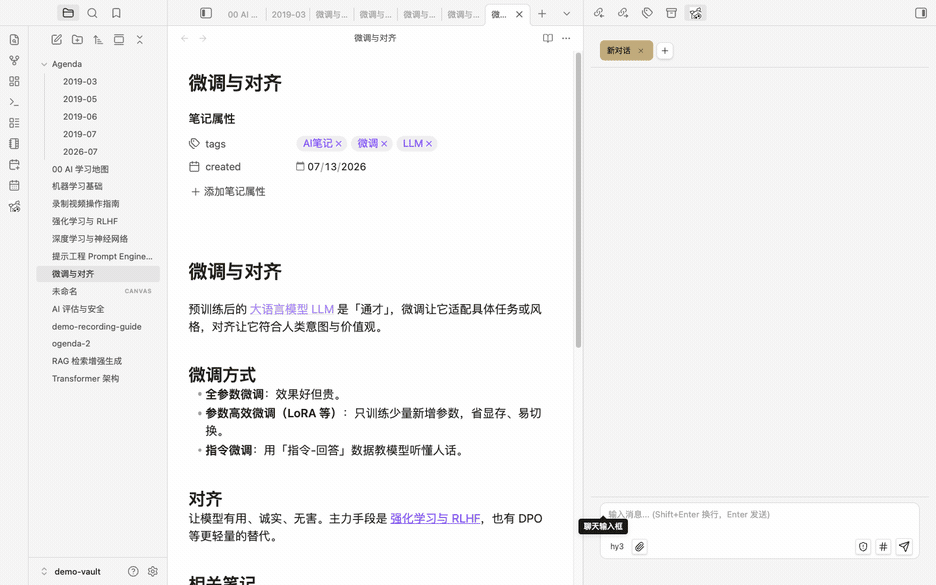
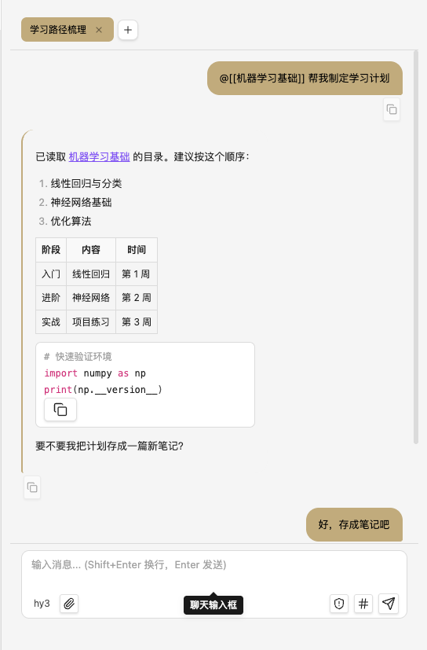
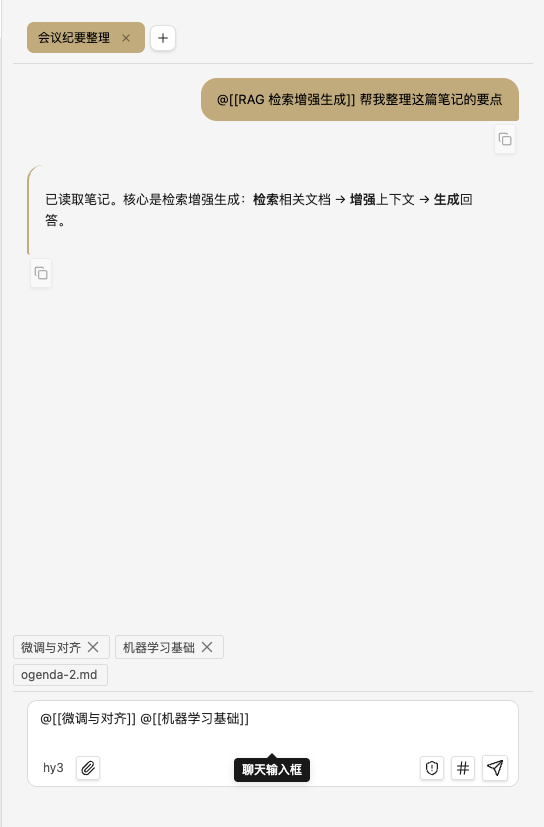

<h1 align="center">Workbuddian</h1>

<p align="center">
  <a href="https://github.com/jiang198012/workbuddian/releases/latest"></a>
  <a href="https://github.com/jiang198012/workbuddian/releases"></a>
  <a href="https://github.com/jiang198012/workbuddian/actions/workflows/ci.yml"></a>
  <a href="https://obsidian.md/plugins?id=workbuddian"></a>
  <a href="https://github.com/jiang198012/workbuddian/stargazers"></a>
  <a href="https://opensource.org/licenses/MIT"></a>
</p>

<p align="center">
  <strong>简体中文</strong> | <a href="./README.en.md">English</a>
</p>

<!--
project: Workbuddian
domain: Obsidian 插件 / AI 聊天 / 本地 LLM agent / Hermes agent / CodeBuddy
audience: Obsidian 中文用户(桌面端, Windows/macOS)
runtime: Obsidian 1.7.2+, CodeBuddy CLI 或 Hermes gateway, Node.js
status: stable (2.6.14)
license: MIT
-->

**Workbuddian** 是一个 **Obsidian 社区插件**，把本地 **CodeBuddy CLI** 或 **Hermes agent** 变成你笔记里的 **AI 聊天助手**——不用切窗口，直接在 Vault 里聊天、`@` 引用笔记、流式回复、改稿。双后端支持,自由切换。

> ⚠️ **仅桌面端**（Windows / macOS），需 Obsidian 1.7.2+。Linux 暂不支持。

<p align="center">
  
</p>

<p align="center">
  
  
</p>

> **⭐ 如果你觉得 Workbuddian 有用,欢迎 [Star 这个仓库](https://github.com/jiang198012/workbuddian),帮助更多人发现它。**

## 功能亮点

| 能力 | 能带来什么 |
| --- | --- |
| **双后端** | 本地 **CodeBuddy CLI**(完整能力)或 **Hermes agent**(gateway 纯对话)自由切换;Hermes 免配置自动发现,模型列表与 Desktop 一致 |
| **流式对话** | 侧边栏或主编辑区全宽标签;可折叠的思考过程与工具调用卡片;Markdown 渲染(代码/表格/列表/引用) |
| **图片视觉** | 粘贴 / 拖拽截图或图片,直接交给 AI 分析 |
| **`@` 四源聚合引用** | 一条消息同时带上子代理(`@Agent`)、MCP 服务器(`@mcp`)、笔记(`@[[笔记]]`)、任意文件,不用手动拼上下文 |
| **气泡内批准卡** | Write / Edit / Bash / MCP 工具按卡批准;计划模式出「计划已就绪」卡,**同一轮继续执行** |
| **行级 diff + 一键撤销** | 每个 Edit / Write 显示改了几行;vault 内的编辑可一键撤销,三道安全闸门保护你的文件 |
| **会话分叉与双面板** | 标签右键分叉任意会话;侧栏 + 主面板各自绑定独立会话,定向停止互不干扰 |
| **MCP 可视化管理** | 列表增删改 / 启停 / 剪贴板导入;JSON 直编双向即时同步;自定义子代理(JSON 定义) |
| **多语言界面** | 中文 / English 即时切换,自定义主色 |
| **对比终端直接用 CLI** | 可视化界面、批准卡、一键撤销、面板集成都在 Obsidian 内完成,不必切到终端 |
| **指令模式 `#`** | 设一条常驻指令 / 人设,对所有对话生效 |
| **WorkBuddy Skills** | 自动发现 `~/.workbuddy/skills`、`~/.codebuddy/skills` 与 Vault 内技能,输入 `/` 选择并调用已安装技能 |

## 安全与权限

Workbuddian 是一个**能执行本地命令的 AI agent 插件**,我们把它能做什么讲清楚:

**会访问什么?**
- 运行你本机的 CodeBuddy / WorkBuddy CLI
- 读写你的 Vault 文件(在你授权时)
- 执行你配置的 MCP 服务器(经批准卡授权)

**什么时候触发?**
- 插件不发送用于预热的对话 prompt；模型列表发现可能建立后台连接。发送对话后，内置 CLI 可能按自身行为额外生成标题。
- 明确安装本地连接扩展后，该组件会随 WorkBuddy 驻留，按需初始化宿主任务服务；不主动创建任务或发送模型消息。

**怎么授权?**
- 每个 Write / Edit / Bash / MCP 操作都在**气泡内批准卡**上让你确认
- vault 外的文件,不经你同意内容根本到不了模型

**你怎么控制?**
- 可关闭「注入 Vault 上下文」
- 可在设置里审查权限与路径
- 可随时查看 `[WB]` 日志确认它做了什么

## 安装

### 前置条件

- **Obsidian 1.7.2+**(桌面版)
- **Windows 或 macOS**(Linux 不支持)
- 已安装并登录 **WorkBuddy 桌面版**（≥ 5.0.5），内含 CodeBuddy CLI。2.6.14 零组件通路已在 macOS / WorkBuddy 5.7.7 实测；旧版兼容说明见下文。

### 从社区插件目录安装(推荐)

1. Obsidian 里打开 **设置 → 第三方插件 → 浏览**
2. 搜索 **"Workbuddian"** → **安装** → **启用**

### 通过 BRAT 追踪最新版

1. 安装社区插件 **BRAT**
2. BRAT → *Add Beta Plugin* → 填 `jiang198012/workbuddian`
3. 在 **设置 → 第三方插件** 里启用

### 手动安装

1. 从 [latest release](https://github.com/jiang198012/workbuddian/releases/latest) 下载 `main.js`、`manifest.json`、`styles.css`
2. 复制到 Vault 目录下的 `.obsidian/plugins/workbuddian/`
3. 重启 Obsidian,在 **设置 → 第三方插件** 里启用

## 快速开始

### WorkBuddy 升级兼容（Issue #10）

**2.6.14 默认无需连接组件**：安装并登录 WorkBuddy 后，直接在 Obsidian 发消息。缺少扩展时使用宿主原生账号代理；桌面端未运行时正常打开已识别的安装，不重启运行中的宿主。沿用原账号，不要求独立 API key、另装 Node 或先在 WorkBuddy 发消息。已有可用 sidecar 保留原通路；同时识别 `WorkBuddy AI` 产品标识。

**原生通路限制**：当前 WorkBuddy 5.7.7 的单次代理约 50 秒、请求/响应约 640 KiB，模型输出完整返回后才交给 CLI，并非逐 token 即时流式。大附件、长输出和超大上下文可能超限。macOS 核心流程已通过，**Windows 实机、长期运行和账单额度差值未验收，Issue #10 保持开放**，见[零组件接入验收报告](docs/issue-10-zero-setup-2026-10-09.md)。

**旧版 2.6.13 的可选连接组件路径**：WorkBuddy 已登录、已运行但插件提示 `sidecar v6 is not running` 或“本地任务服务尚未初始化”时，在 Obsidian 命令面板运行 **“Workbuddian: 安装 WorkBuddy 本地连接扩展”**，核对目标目录并确认；保存任务后正常退出并重开 WorkBuddy 一次，再回到 Obsidian 发送消息。无需重新登录，也无需先在 WorkBuddy 发送一条消息。

连接组件只执行固定的宿主预热入口，不发送模型消息、不读取登录凭据、不授予会话或任意 RPC 权限；插件不会自动安装或替你重启 WorkBuddy。macOS 已验证冷启动与宿主重启后的原会话恢复，**Windows 实机和长期稳定性仍待验证**，详见[冷启动验收报告](docs/issue-10-cold-start-diagnosis-2026-10-07.md)。

如果桌面端正常、插件却报 `missing-key`、`Authentication required` 或 `refusal`，可能是宿主凭据通路不可用，不能据此认定 WorkBuddy 未登录，重新登录也不保证解决。**2.6.12** 针对 [Issue #10](https://github.com/jiang198012/workbuddian/issues/10) 适配 WorkBuddy 自有 sidecar，创建独立 Vault worker：需原桌面端已登录并保持运行，沿用原账号与额度；旧版未提供 bootstrap 的 WorkBuddy 继续使用 stdio。

macOS 已实测原账号对话、Vault 读写与重载续聊，**Windows 实机待验证**；Issue #10 保持开放等待反馈。此适配依赖 WorkBuddy 内部 IPC，并非官方承诺稳定的公开接口。详见[验收报告](docs/issue-10-host-acceptance-2026-09-29.md)。2.6.10 及更早版本不包含本次适配。

- 自动检测仅选择 WorkBuddy 内置 CLI（包括指向它的符号链接）。未找到时明确提示，不会改用独立 CodeBuddy 的账号或额度。
- 保留手动指定路径及 `CODEBUDDY_PATH`；路径失效时不自动替换到另一产品。若主动指定独立 CLI，它使用自己的认证与额度，不代表共享 WorkBuddy 订阅。
- 插件不读取、复制或解密 WorkBuddy 登录凭据，也不会自动要求安装或登录另一个 CLI。
- 切换 CLI 路径后会重启插件管理的进程并重新加载会话，不会自动重发失败请求。

插件会读取 ACP 返回的结构化认证错误（包括 `refusal` 中的错误元数据），不依赖 CLI 日志是否输出到 stderr。检测到 `missing-key` 时显示凭据通道提示；没有认证证据的普通拒绝不会被误判为登录失败。

### 打开对话

1. 点击左侧 **机器人图标**,或运行命令 **"Workbuddian: 打开聊天面板"**
2. 确认已安装并登录 WorkBuddy。2.6.14 原生通路使用桌面端自带运行时，无需额外安装 Node。
3. 发第一句话。**你会看到**:面板出现你的对话、模型加载完成。自定义安装目录未检测到时，在设置中指定该安装内的 CLI 路径。

旧版或显式选择其他 CLI 时，如果找不到 CodeBuddy / Node.js，可在 WorkBuddy 对话中执行以下环境配置:

```
请帮我配置 Workbuddian 插件的运行环境,步骤如下:
1. 搜索 WorkBuddy 安装目录下的 vendor/node.zip(常见位置:C:\Program Files\WorkBuddy、D:\Program Files\WorkBuddy、%LOCALAPPDATA%\Programs\WorkBuddy)
2. 如果 ~/.workbuddy/binaries/node/versions/ 下还没有可用的 node.exe,将 node.zip 里的 node-v*-win-x64/ 目录解压,把文件复制到 ~/.workbuddy/binaries/node/versions/{版本号}/
3. 执行 ~/.workbuddy/binaries/node/versions/{版本号}/node.exe --version 确认可用
4. 可选:同样处理 vendor/PortableGit.zip
完成后告诉我环境是否就绪。
```

> **Vault 读写权限**:如果使用时提示权限不足,把 `提示词-授予Vault读写权限.md` 的完整内容发给 WorkBuddy/CodeBuddy 执行一次,然后**完全退出**(系统托盘右键退出)再重开。

## 使用方法

### 对话与流式输出

输入消息按 **Enter** 发送,**Shift + Enter** 换行。sidecar 等流式通路逐步显示回复；2.6.14 原生账号代理先缓冲模型输出再显示。思考过程与工具调用可折叠。

### `@` 引用任意内容

输入 `@` 会弹出聚合下拉(子代理 / MCP 服务器 / Vault 文件)。Markdown 笔记读正文嵌入,其它文件作附件交 CLI 读:

- `@[[笔记名]]` — 读取笔记全文作为上下文
- `@Agent/名称` — 调用子代理
- `@mcp/名称` — 调用 MCP 服务器

笔记里选中的文字会自动作为只读上下文随消息发送。

### 调用已安装 Skill

输入 `/` 打开补全列表即可看到 WorkBuddy / CodeBuddy 已安装的技能。选择技能后会填入 `/skill-name `,继续输入任务并发送；CodeBuddy 会按官方 Skills 约定加载对应的 `SKILL.md`。

插件只读取技能的 `name` 与 `description` 用于补全，不会默认把全部技能正文发送给模型。支持的目录：

- 用户级：`~/.workbuddy/skills/<name>/SKILL.md`、`~/.codebuddy/skills/<name>/SKILL.md`
- Vault 级：`<Vault>/.workbuddy/skills/<name>/SKILL.md`、`<Vault>/.codebuddy/skills/<name>/SKILL.md`（同名时覆盖用户级）

技能本身的工具调用仍受当前权限模式与批准卡控制。

### 气泡内批准卡

Write / Edit / Bash / MCP 操作都会弹出批准卡,确认后才执行。计划模式出「计划已就绪」卡,批准后**同一轮**继续执行。

### 行级 diff 与一键撤销

每个 Edit / Write 完成后显示结构化 diff(默认折叠)。vault 内编辑可一键撤销——文件已变 / 替换不唯一 / 纯删除时安全闸会拒绝并说明原因。

### 会话分叉与双面板

标签右键可**分叉当前会话**(含全部历史)。侧栏与主面板可同时打开,各自绑定独立会话,互不干扰。

### 计划模式

让 AI 先出计划,以卡片形式读完,再一键执行。执行会重新发起一轮并使用「自动接受编辑」权限,**仅对这一次生效**,不改你的权限设置。

### 多语言界面

设置里可切换 **Auto / 中文 / English**,即时生效。

## 设置

| 分组 | 设置项 | 说明 | 默认值 |
| --- | --- | --- | --- |
| CodeBuddy 连接 | CodeBuddy 路径 | CLI 可执行文件路径(留空自动检测) | 自动 |
| | 手动指定 Node.js 路径 | 留空自动探测;失败时手动指定 node 完整路径 | 自动 |
| | CLI 超时时长(分钟) | 单次响应最长等待时间,超时强制中断 | 5 |
| | 思考力度 | 对应 CLI thought_level(按会话生效),`/effort` 改动同步回这里 | enabled |
| | MCP 服务器 | stdio 传输的 MCP 服务器 JSON 数组;可视化列表 + JSON 双向同步 | 空 |
| | 子代理 | 自定义子代理 JSON(对应 CLI `--agents`,支持 tools/model 键) | 空 |
| 上下文注入 | 注入 Vault 上下文 | 每次消息附上当前 Vault 路径 | 开 |
| | 注入当前笔记链接 | 每次消息附上当前笔记标题+路径(不含正文) | 关 |
| | 自动生成会话标题 | 首轮回复后由 AI 命名新会话;手动改名不被覆盖 | 开 |
| | 粘贴图保留数量 | 插件目录内最多保留的粘贴图数量,0 = 不限制 | 20 |
| 外观 | 界面语言 | Auto(跟随 Obsidian)/ 中文 / English | Auto |
| | 聊天主色调 | 自定义强调色;「恢复默认」跟随 Obsidian 主题色 | 跟随主题 |
| | 上下文窗口上限(token) | 上下文用量百分比的分母,按模型窗口调整 | 200000 |
| 管理 | 导出设置 | 把当前设置保存为 JSON 文件,便于备份/迁移 | — |
| | 导入设置 | 从导出的 JSON 文件恢复设置 | — |
| | 重置为默认 | 清空所有自定义设置,恢复插件默认值 | — |
| | 查看日志 | 打开 `[WB]` 日志面板,排查问题用 | — |

> **模型**与**授权模式**已移到聊天输入框工具栏:点当前模型名切换模型,点盾牌图标切换权限(默认 / 完全访问)。工具栏还有 **📎 附件** 与 **`#` 常驻指令**。

## 自动发现

插件启动时搜索以下位置；CLI 自动选择仅接受已识别的 WorkBuddy 内置程序或其符号链接，不会选择独立 npm CLI。手动路径与 `CODEBUDDY_PATH` 不受自动发现限制，Node.js 仍可从其他安装来源查找：

| 搜索目标 | Windows | macOS |
|----------|---------|-------|
| WorkBuddy 安装 | `%LocalAppData%\Programs\WorkBuddy\...`、`%ProgramFiles%\WorkBuddy\...` | `/Applications/WorkBuddy.app/...`、`~/Applications/WorkBuddy.app/...` |
| npm 全局安装 | `%AppData%\npm\codebuddy.cmd` | npm 全局 `bin/` |
| 系统 PATH | 遍历 `PATH` 查找 `codebuddy.cmd` / `codebuddy.exe` | 遍历 `PATH` 查找 `codebuddy` / `node` |
| 版本管理器 | nvm / volta | nvm(`~/.nvm`)、volta(`~/.volta/bin`) |
| Homebrew | — | `/opt/homebrew/bin`(Apple Silicon)、`/usr/local/bin`(Intel) |
| WorkBuddy 自带 Node | `~/.workbuddy/binaries/node/versions/*/` | `~/.workbuddy/binaries/node/versions/*/` |

## What's New

**最新版本 2.6.14**

- **2.6.14** — **原账号零组件接入**：无扩展时使用 WorkBuddy 原生账号代理，宿主未运行可正常自动打开；无需安装连接组件、重启宿主或另装 Node。补齐 `WorkBuddy AI` 标识。macOS 首发、自动启动、取消后续聊通过；**原生通路约 50 秒 / 640 KiB，模型输出缓冲返回，Windows 实机待验证，Issue #10 保持开放**。

- **2.6.13** — **WorkBuddy 冷启动与恢复**：新增明确确认的本地连接扩展安装入口，修复 5.7.6 无 sidecar 时首次连接失败；补齐超时、取消、重复发送与清理防护。demo-vault 冷启动及宿主重启后的原会话恢复通过；沿用原账号，**Windows 与长期运行待实测，Issue #10 保持开放**。

- **2.6.12** — **WorkBuddy 原账号调用恢复**：适配 5.6.2 宿主凭据通路，修复连续回复夹带旧消息及重连清理；不自动切换独立账号。macOS 已验收核心流程，**Windows 待实机验证，Issue #10 暂不关闭**。2.6.11 因 Linux 测试夹具路径问题未生成 Release；2.6.12 修复夹具后发布，未重写旧标签。

- **2.6.10** — **输入体验与路径保护**：输入框支持最小/最大高度和随文本自动收缩，修复 Vault 相似前缀路径误判。

- **2.6.9** — **模型菜单去重**：同步动态模型列表，删除 `Auto`、`Hy3`、`Hy4 preview` 的重复入口，保留基础模型选项。

- **2.6.8** — **Obsidian 规范修复**：使用 `setCssProps` 设置输入框高度，消除静态样式赋值 lint 报错。

- **2.6.7** — **GitHub 发布资产完善**：Release 直接附带 `main.js`、`manifest.json` 和 `styles.css`，可从 GitHub Release 安装插件。

- **2.6.6** — **演示流程更新**：重录并重剪 README GIF，恢复高信息密度的 `@` 引用、回复结果与笔记地图演示，并补充 `/summarize` 新流程。

- **v2.6.5** — **Skill 调用**：发现 WorkBuddy / CodeBuddy 已安装技能,输入 `/` 选择后直接调用。

- **v2.6.4** — **全功能测试问题修复**:
  - 停止生成即时取消,避免迟到的 ACP 响应重新触发生成;放宽 ACP 握手与 Hermes 自检超时
  - 修复主编辑区大面板误用侧栏、模型按钮状态不可见、删除会话后双面板标签/搜索结果残留
- **v2.6.3** — **会话工作区与回复写回**:
  - 会话级模型/授权/推理强度/常驻指令覆盖,并支持 Vault 上下文与当前笔记链接独立开关
  - 草稿与附件按会话恢复;助手回复可插入当前笔记或保存为带来源元数据的新笔记

- **v2.6.2** — **后端切换卫生**:
  - 切到 Hermes 后不再残留 CodeBuddy 模型:自动回落 auto(跟随 Hermes 默认模型),旧配置启动自愈
  - 设置页「后端连接」正名,CodeBuddy 专属行(CLI 路径/Node/自定义 agents)在 Hermes 模式下不再误显
- **v2.6.1** — **Hermes 直连热修**:
  - 修复 Hermes 直连必现「连不上/未检测到 CLI」:spawn 不再用 node 解释 hermes 的 bash 启动脚本
  - 修复 Hermes 模型菜单错串 CodeBuddy 候选:握手前只显示 auto,握手后展示 Hermes 真实模型列表
- **v2.6.0** — **Hermes ACP 完整版(新)**:
  - Hermes 后端升级全能力代理:工具块/批准卡/思考流/用量/历史回放/会话分叉/模型切换,与 CodeBuddy 后端体验对齐
  - **自动降级**:本机 CLI 不可用时粘性降级 HTTP 轻量模式(纯对话),顶条提示;改配置即自动重探
  - **远程 gateway 兜底**:填非本机 gateway 地址直接轻量模式;设置页新增运行模式状态行 + 高级折叠组
- **v2.5.1** — **Hermes agent 后端支持(新)**:
  - 本地 Hermes gateway 作为第二后端,与 CodeBuddy CLI 自由切换
  - **免配置自动发现**:自动从 `~/.hermes` 读 gateway 地址与 API key,模型列表与 Hermes Desktop 一致
  - 设置页优化:语言置顶「通用」组、插件清单折叠沉底、搜索框浮层下拉、插件行饱满化
- **v2.3.1** — 批量导出 + 代码块进笔记 + 斜杠命令清理:
  - 命令面板「导出所有会话为笔记」,一键备份全部对话
  - 代码块 hover 出三按钮:复制 / 插入到当前笔记 / 保存为新笔记
  - 斜杠命令删重复入口,CLI 透传命令补全带 `(CLI)` 标注
- **v2.3.0** — 消息级操作 + 会话模板 + 浮动内联编辑:
  - 消息行 hover 出操作菜单:user「编辑并重发」/ assistant「重新生成」
  - 新建对话可选预设场景(写作/翻译/代码审查/笔记整理),自动带常驻指令 + 开场白
  - 选中文字 → 右键「Workbuddian编辑」/ Cmd+Shift+E → 选区上方浮动工具条,就地改不弹窗
  - 修复:最近回复缺复制按钮;完全访问仍弹批准卡
- **v2.2.0** — 会话管理与 MCP 全面升级 + 中文体验深耕:dual-pane 常驻会话管理器、会话置顶/搜索/删除确认、context-saving MCP(@激活才注入)、国内模型中文名、CodeBuddy 插件管理、模板 prompt、@stats、命令面板增强、用量预警条。
- **v2.2.1–v2.2.3** — 修复:最近回复缺复制按钮;manifest 描述合规;完全访问仍弹批准卡。
- **v2.1.0** — 首轮 UX 体检驱动的全面改造 + e2e 测试基建。
- **v2.0.0** — 新引擎:ACP 持久会话 + wire 级可靠性攻坚。单进程承载所有对话,上下文真保持;批准卡进气泡;工具调用增量渲染 + 结构化 diff + 一键撤销;`@` 四源聚合;MCP 可视化管理;会话分叉;双面板隔离。
- **v2.0.1** — 完全独立代码基座(与上游相似度 <30%)。
- **更早版本** — 详见 [CHANGELOG](CHANGELOG.md)。

## 故障排查(FAQ)

**找不到 CodeBuddy CLI?**
自动检测未找到(如自定义安装路径)。在插件设置中手动填写路径。默认位置:`WorkBuddy安装目录\resources\app.asar.unpacked\cli\bin\codebuddy`。

**找不到 Node.js?**
完成上方「快速开始」里的环境初始化提示词。

**发消息后一直显示「思考中」或无响应?**
先直接重试;如果进程意外退出,插件会**自动重启**并恢复会话上下文。仍无响应则打开开发者控制台看 `[WB]` 日志(chunk 类型、exit code、stderr)。

**权限反复询问?**
每个 Write / Edit / Bash 都需要批准是**默认行为**。可切换到「完全访问」跳过,或用「按路径总是允许」放行指定目录。

**重启后对话丢失?**
已修复。历史对话自动持久化,重启后仍可恢复。

**Linux 能用吗?**
暂不支持。仅 Windows / macOS 桌面端。

## 开发

```bash
npm install    # 安装依赖
npm run dev    # 开发构建(esbuild watch)
npm run build  # 生产构建(tsc 类型检查 + esbuild 打包)
npm test       # 运行测试(jest,617 项)
```

e2e 测试基建(`scripts/e2e/`)用 Playwright CDP 驱动真实 Obsidian,覆盖插件加载、面板打开、消息发送、流式回复与双面板回归。

## 相关项目

- **BuddyBridge**（MIT）—早期版本的部分基础设施代码曾参考/使用其实现；当前版本已独立重构。版权与来源见 `LICENSE` / `NOTICE`。
- **Claudian**(MIT)— 在 Obsidian 里用 Claude Code 的同类插件。Workbuddian 的 UI 参考其设计模式(仅设计模式,无代码拷贝)。见 `LICENSE` / `NOTICE`。
- **CodeBuddy / WorkBuddy** — 本插件的后端 CLI,本地编程 agent。

## 支持

- 提交 bug 或功能请求:[GitHub Issues](https://github.com/jiang198012/workbuddian/issues)(提交前请先看上方 FAQ)

## License

MIT。见 [LICENSE](LICENSE)。
